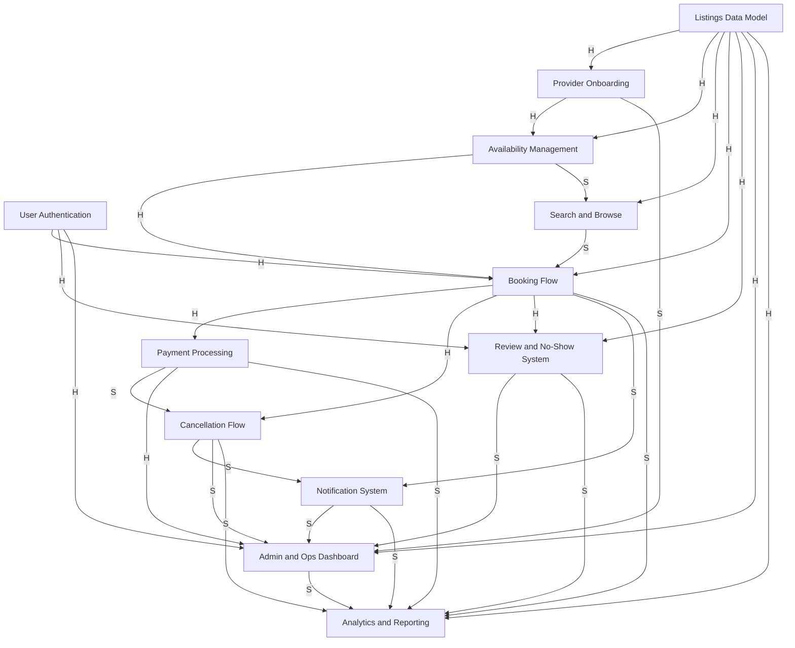

# Module 02 Dependency Graph - SkillSwap

Chosen representation: visual graph.

## 1. Buildable Work Items

1. User Authentication
2. Listings Data Model
3. Provider Onboarding
4. Availability Management
5. Search and Browse
6. Booking Flow
7. Payment Processing
8. Cancellation Flow
9. Notification System
10. Review and No-Show System
11. Admin and Ops Dashboard
12. Analytics and Reporting

## 2. Dependency Graph

Legend:
- `H` = hard dependency
- `S` = soft dependency

## 3. Edge List With Labels

- User Authentication -> Booking Flow (H)
- User Authentication -> Review and No-Show System (H)
- User Authentication -> Admin and Ops Dashboard (H)
- Listings Data Model -> Provider Onboarding (H)
- Listings Data Model -> Availability Management (H)
- Listings Data Model -> Search and Browse (H)
- Listings Data Model -> Booking Flow (H)
- Listings Data Model -> Review and No-Show System (H)
- Listings Data Model -> Admin and Ops Dashboard (H)
- Listings Data Model -> Analytics and Reporting (H)
- Provider Onboarding -> Availability Management (H)
- Provider Onboarding -> Admin and Ops Dashboard (S)
- Availability Management -> Booking Flow (H)
- Availability Management -> Search and Browse (S)
- Search and Browse -> Booking Flow (S)
- Booking Flow -> Payment Processing (H)
- Booking Flow -> Cancellation Flow (H)
- Booking Flow -> Review and No-Show System (H)
- Booking Flow -> Notification System (S)
- Booking Flow -> Analytics and Reporting (S)
- Payment Processing -> Cancellation Flow (S)
- Payment Processing -> Admin and Ops Dashboard (H)
- Payment Processing -> Analytics and Reporting (S)
- Cancellation Flow -> Notification System (S)
- Cancellation Flow -> Admin and Ops Dashboard (S)
- Cancellation Flow -> Analytics and Reporting (S)
- Notification System -> Admin and Ops Dashboard (S)
- Notification System -> Analytics and Reporting (S)
- Review and No-Show System -> Admin and Ops Dashboard (S)
- Review and No-Show System -> Analytics and Reporting (S)
- Admin and Ops Dashboard -> Analytics and Reporting (S)

## 4. Why The Hard Dependencies Are Hard

- Listings Data Model is foundational because provider profiles, pricing, categories, and listing structure must exist before search, booking, reviews, and analytics can use those fields.
- User Authentication is a hard dependency for booking, review, and admin access because identity must exist before those workflows can safely execute.
- Availability Management is a hard dependency for Booking Flow because users cannot reserve time that has not been modeled and exposed.
- Booking Flow is a hard dependency for Payment Processing, Cancellation Flow, and Review and No-Show System because each one operates on an actual booking record.

## 5. Starting Points (No Incoming Dependencies)

- User Authentication
- Listings Data Model

These are the best starting points because they unlock most other work and sit closest to the system foundation.

## 6. Endpoints (No Outgoing Dependencies)

- Analytics and Reporting

This is an endpoint because it depends on events and workflows from the rest of the system rather than unlocking them.

## 7. Notable Parallel Tracks

- After Listings Data Model exists, Provider Onboarding, Search and Browse, and parts of Admin and Ops Dashboard can begin in parallel.
- After User Authentication and Listings Data Model exist, some Booking Flow preparation can happen while Provider Onboarding and Availability Management continue.
- After Booking Flow exists, Payment Processing, Notification System stubs, and Review and No-Show System can move in parallel.

## 8. Notable Tensions and Risks

- Payment Processing and Cancellation Flow have a soft dependency boundary because cancellation rules can be designed with a payment interface stub, but final refund behavior still depends on real payment integration.
- Search and Browse depends hard on Listings Data Model but only soft on Availability Management. Search can start with static listing data and later add real-time availability filters.
- Provider Onboarding and Admin and Ops Dashboard are related, but dashboard work can partially start with stubs while approval workflow details are refined.

## 9. Coverage Check Against Module 01

- User browse, search, booking, payment, confirmations, and cancellations are covered.
- Provider availability, pricing, descriptions, earnings, reviews, and no-show flagging are covered.
- Platform commission, payout consistency concerns, provider vetting, admin approvals, disputes, analytics, and multi-city constraints are represented.
- The cancellation-policy contradiction remains a blocker that affects Cancellation Flow, Payment Processing, Notification System, Admin and Ops Dashboard, and Analytics and Reporting.
